# MCP advanced — study guide (with figures)

Read **`basics.md` first** (host / client / server, tools, resources, prompts). This file goes deeper: **message shapes**, **transports (stdio vs Streamable HTTP)**, **sampling**, **logging & progress**, **roots**, and production gotchas.

**Hands-on sandbox in this repo:** [`mcp-advanced/`](../mcp-advanced/) — a minimal **Streamable HTTP** FastMCP server using `stateless_http=True`, `json_response=True`, plus `Context` logging and progress on a sample tool. Compare with the main project’s **stdio** server in the repo root.

---

## Figure index — all files in `notes/images/`

Use this table to find the right diagram quickly. Paths are relative to this file (`notes/advanced.md` → use `images/...`).

| File | Topic | When to look at it |
|------|--------|-------------------|
| `json-message-format.png` | JSON-RPC envelope | Learning `method` / `params` / `id` / `result` |
| `mcp-message-category.png` | Request vs notification | One-way vs paired messages |
| `message-types-flow.png` | Message flow | How categories fit a session |
| `four-communication-scenarios.png` | Transport scenarios | Contrasting how client and server talk |
| `mcp-client-server-communication.png` | Client ↔ server | Stdio-style bidirectional messaging (see also `basics.md`) |
| `mcp-intro.png` | Big picture | Stack overview (see also `basics.md`) |
| `SSE-protocol.png` | Streamable HTTP / SSE | Why HTTP needs an extra channel |
| `SEE-connection.png` | SSE connection | Long-lived / short-lived connections (filename uses “SEE”) |
| `session-mcp.png` | Sessions | Session id + init over HTTP |
| `mcp-server-remote.png` | Remote server | Hosting MCP over the network |
| `traffic-mcp.png` | HTTP traffic | How requests and streams relate |
| `load-balancer-mcp.png` | Load balancing | POST vs SSE hitting different instances |
| `SSE-loadbalancer.png` | LB + SSE | Same problem, alternate view |
| `stateless-http.png` | `stateless=true` | Scaling tradeoffs |
| `sampling-solution1.png` | Sampling contrast | **Option A:** server calls the LLM directly |
| `sample-solution2.png` | Sampling | **Option B:** server asks **client** to call LLM (real sampling) |

---

## 1. JSON message types

MCP’s **data layer** is **JSON-RPC 2.0** between clients and servers. The transport (stdio or HTTP) only carries these messages.

### 1.1 Categories

| Category | Description | Examples (conceptual names) |
|----------|-------------|-----------------------------|
| **Request / result pairs** | Client or server sends a request; the other side replies with a result (or error). | `initialize` + result, `tools/call` + tool result |
| **Notifications** | One-way: **no** `id`, **no** response. | Progress, logging, “list changed” style events |

### 1.2 Direction

- **Client → server:** most tool and resource calls.
- **Server → client:** notifications anytime; **server-initiated requests** (e.g. **sampling**) when the client advertised support.

**Important:** The wire is **bidirectional** in principle. That is why **plain request/response HTTP** is awkward: the server often needs to **push** or **ask** the client something. Streamable HTTP addresses that with **SSE** (and session routing).

### 1.3 Structure

- Typical fields: `jsonrpc`, `method`, `params`, and `id` on requests; `result` or `error` on responses.
- The canonical shapes live in the [MCP specification](https://modelcontextprotocol.io/specification/latest); the spec repo’s schema/types are the reference for field names.

**Figures — message format and categories**

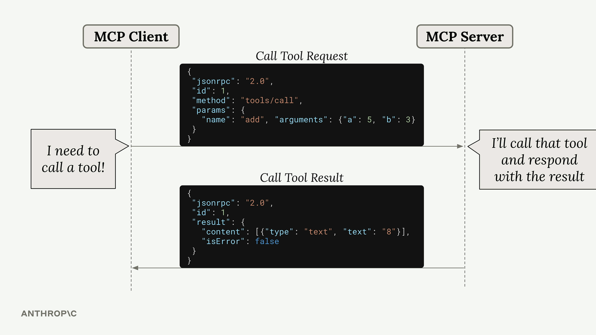

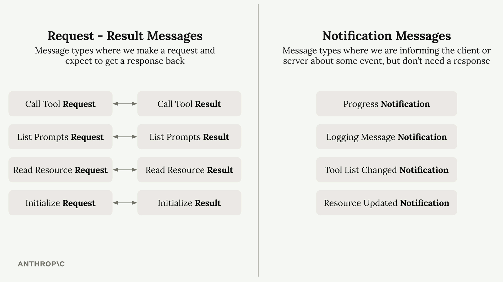

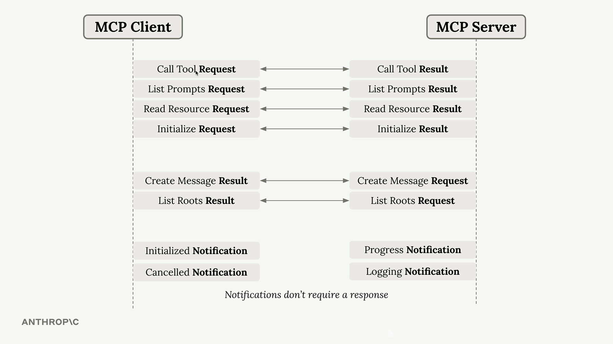

---

## 2. Transports

A **transport** moves JSON-RPC messages between **one MCP client** and **one MCP server**.

**Figure — multiple communication patterns**

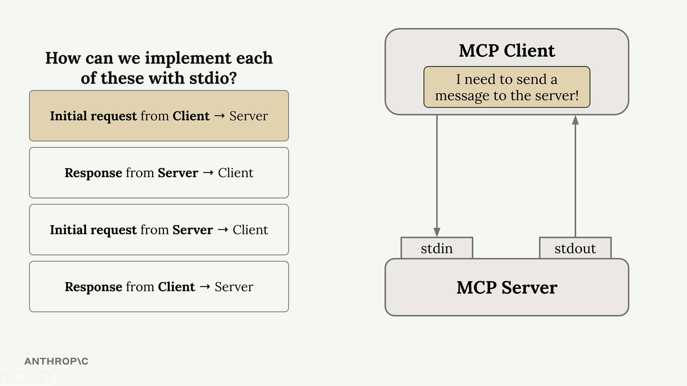

---

### 2a. Stdio transport

The client **starts the server as a subprocess** and talks over **stdin / stdout**.

```text
Client → writes to server stdin
Client ← reads from server stdout
```

**Typical lifecycle (conceptual)**

1. Client sends **`initialize`** request → server returns capabilities + protocol version.
2. Client sends **`notifications/initialized`** (no response).
3. Normal traffic: `tools/list`, `tools/call`, `resources/read`, etc.

| Stdio | |
|-------|--|
| **Pros** | Fully **bidirectional** on one pipe pair; simple for local dev; no TLS/cookies. |
| **Cons** | **Same machine** (same OS process tree); not a public URL. |

**Figure — client/server messaging (stdio-friendly mental model)**

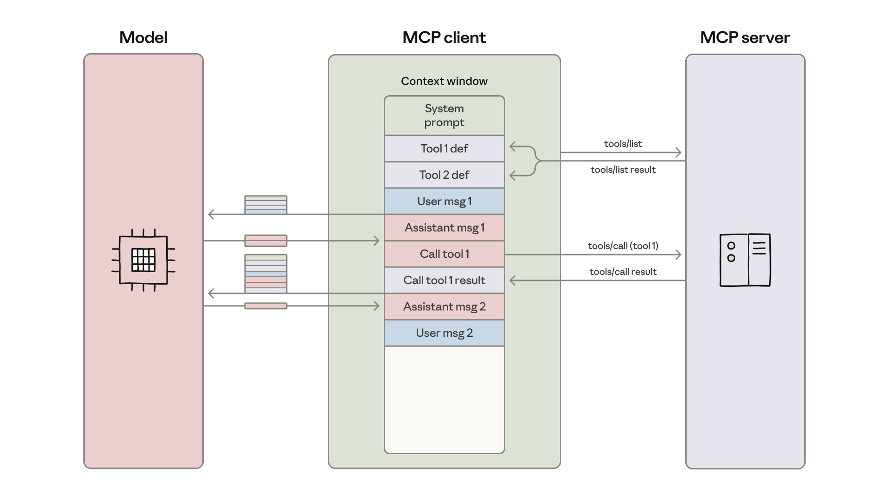

**In this repo (root):** `mcp_server.py` uses `transport="stdio"`; `mcp_client.py` uses `stdio_client`.

---

### 2b. Streamable HTTP transport

**Remote servers** expose MCP at an HTTPS URL. Raw HTTP is **client-pull** by default; MCP adds **Server-Sent Events (SSE)** so the **server can stream** events and **reach the client** while a session is active.

**Figures — HTTP, remote server, sessions, SSE**

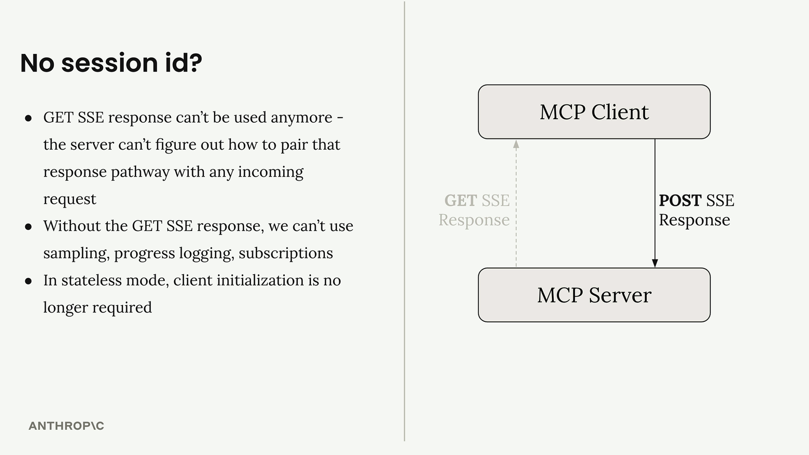

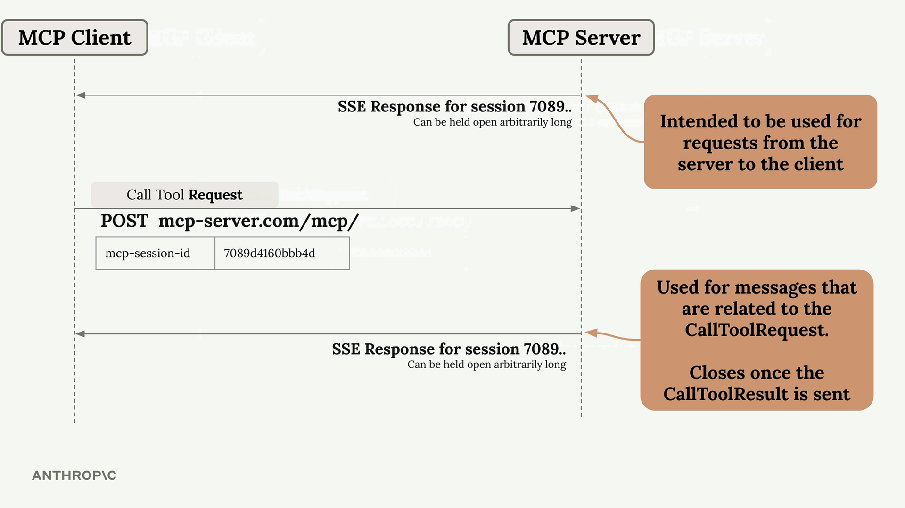

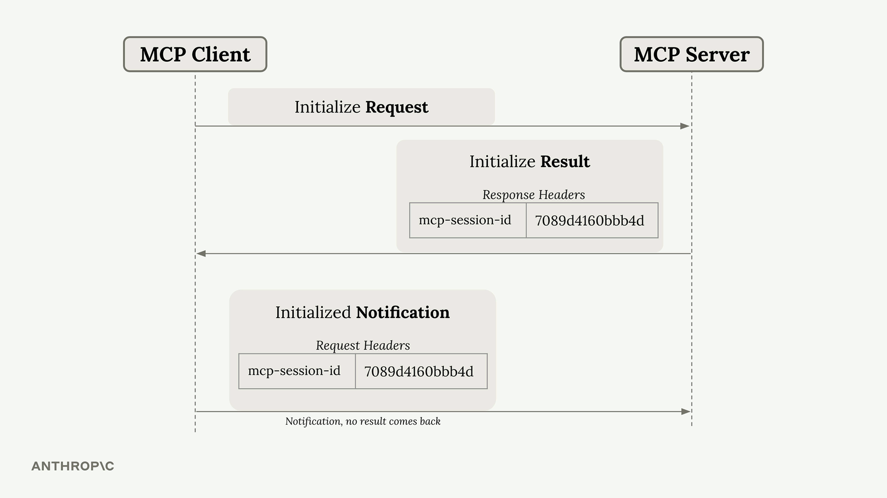

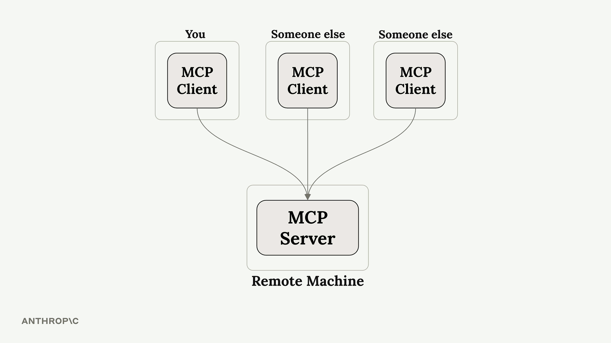

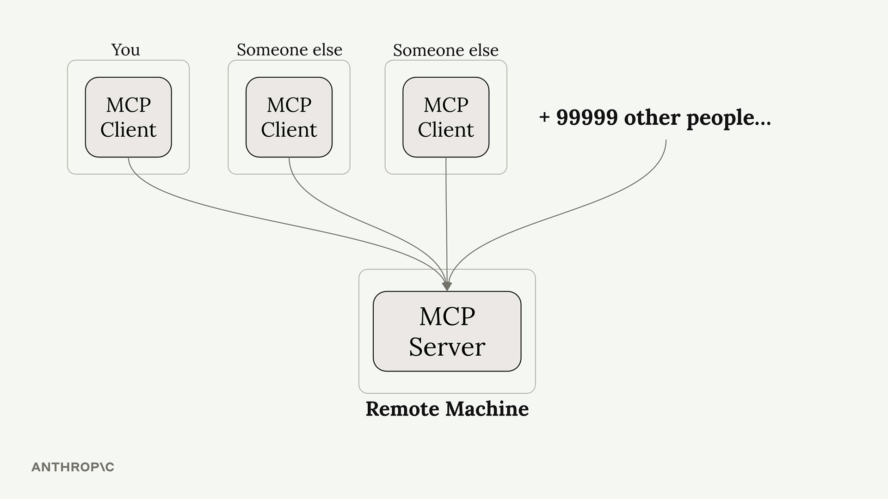

**Session outline (typical)**

1. Client `POST`s **`initialize`** → server responds with result and often an **MCP session** identifier (e.g. header).
2. Client sends **`initialized`** notification, scoped to that session.
3. Client may open a **`GET` SSE** stream **for that session** so server→client messages (notifications, sampling asks, etc.) have a path.

**Two SSE “shapes” (mental model)**

| Connection | Role | Lifetime |
|------------|------|----------|
| **Long-lived SSE** | Server→client: sampling requests, some notifications, ongoing updates | For the session |
| **Short-lived SSE** | Streamed **tool** output / single operation | Closes when that operation completes |

Exact behavior depends on client and server implementation; always verify against your SDK version and the current spec.

**Deployment warning:** An app that only ever used **stdio** can **break** when moved to HTTP if you assume the server never talks first, or if proxies buffer SSE incorrectly.

---

### 2c. Load balancing: why POST and SSE must align

A client may hold:

- a **POST** channel for requests, and  
- a **GET SSE** channel for server→client.

A naive load balancer can send those to **different instances**. Then server A might need to push to a stream opened on server B — which fails without sticky sessions or architectural changes.

**Figures — load balancer problem**

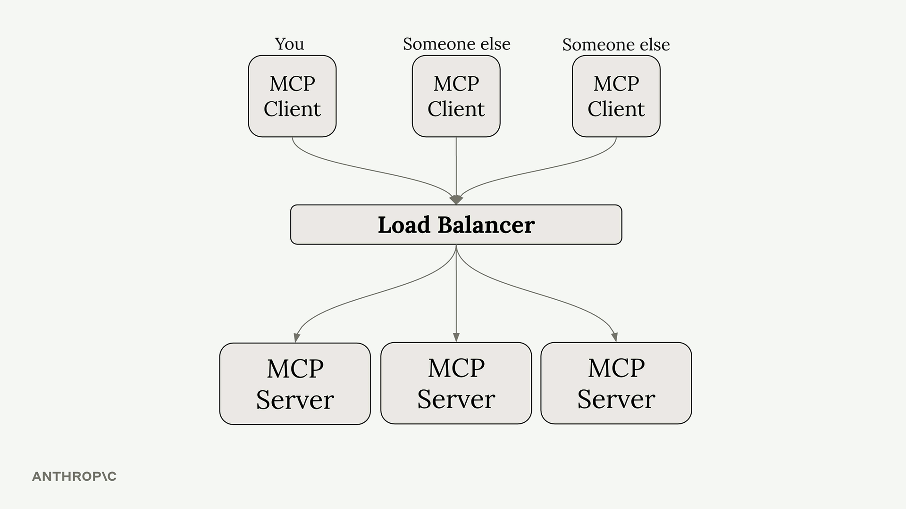

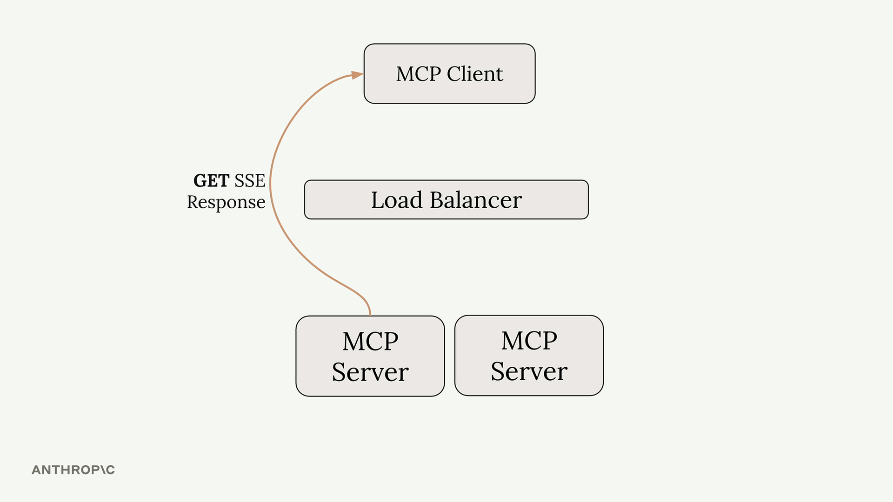

---

### 2d. `stateless=true` (horizontal scaling mode)

Some servers run with **`stateless=true`** so each HTTP request can hit **any** instance without shared memory.

**Typical tradeoffs**

| Effect | Detail |
|--------|--------|
| No sticky session story | Server does not rely on in-memory session per client |
| **GET SSE often disabled or limited** | Harder for server to initiate long-lived streams |
| **Sampling** | Usually **not available** in this mode (no reliable return path) |
| **Progress / logging streams** | Often **gone** or reduced |
| **Subscriptions** | Resource subscriptions may be unavailable |

**Figure**

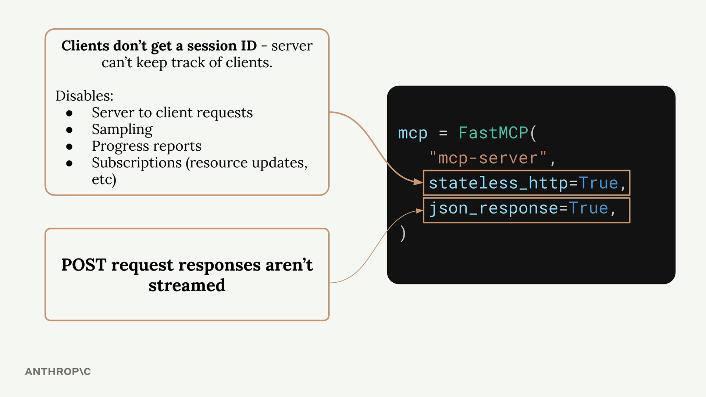

---

### 2e. `json_response=true`

Forces **non-streaming** POST responses: the client waits for the **final** JSON result.

- No mid-flight progress/log lines on that POST.
- Simpler clients; worse UX for long tools.

**Best practice:** Develop against the **same transport and flags** you deploy with.

---

### Sandbox: `mcp-advanced/`

[`mcp-advanced/main.py`](../mcp-advanced/main.py) runs FastMCP with:

- `transport="streamable-http"`
- `stateless_http=True`
- `json_response=True`

and a demo tool that uses:

- `await ctx.info(...)` — logging-style feedback  
- `await ctx.report_progress(...)` — progress  

This is ideal to see **how the API looks in code** even when streaming UX is limited by flags.

```bash
cd mcp-advanced && uv sync && uv run main.py
```

---

## 3. Sampling (with a concrete story)

**Sampling** means: the **server** asks the **client/host** to run an **LLM completion** (e.g. call Claude) and **return the text**. The server does **not** hold API keys for the model.

### 3.1 Example scenario

1. User (via **Next.js + MCP client**) asks the model: *“Research a topic.”*
2. The model issues a **tool call**: run a `research` tool on the **MCP server**.
3. The server fetches raw material (e.g. from Wikipedia).
4. The server needs a **summary**. It can do that in two very different ways:

---

### Option A — Server calls the LLM directly (not sampling)

The MCP server has **its own** Claude/API access and calls the model after research.

**Figure — Option A**

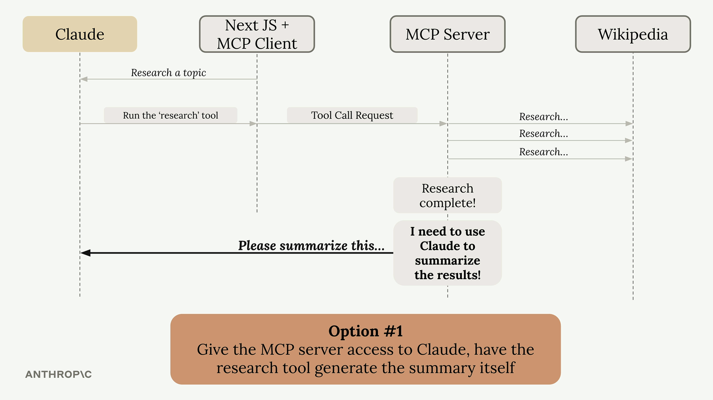

**Downsides**

- API keys and billing live **on the server**.
- Harder to offer a **public** MCP server safely.
- Duplicates policy that the host already enforces (model allowlists, logging, etc.).

---

### Option B — Sampling (server asks client to call Claude)

After research, the server sends a **sampling / createMessage-style request** to the **client**. The client calls **Claude** with **its** credentials and returns the completion to the server. The tool then finishes.

**Figure — Option B (sampling)**

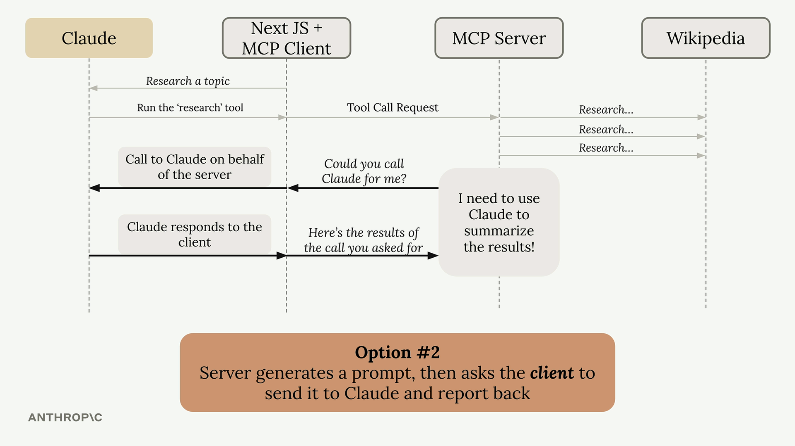

**Upsides**

| Benefit | Detail |
|---------|--------|
| **No model keys on the server** | Client/host owns auth and spend. |
| **Central policy** | Host can refuse, redact, or route models. |
| **Public-friendly servers** | Server stays a capability layer, not a token vault. |

**Sketch — roles**

```text
Server  →  "Please sample these messages"  →  Client
Client  →  LLM (Claude) with host API key
Client  →  "Here is the completion"        →  Server
```

**Pseudocode shape (names vary by SDK)**

Server side (conceptual):

```python
result = await create_message(messages=[
    {"role": "user", "content": "Summarize the following research: ..."}
])
```

Client side (conceptual):

```python
async def sampling_handler(request):
    text = await call_llm_in_host(request.messages)
    return build_sampling_result(text)
```

**In the root project:** sampling is **not** wired yet (`mcp_server.py` / `mcp_client.py`). Implementing it is a strong “advanced” exercise once you use HTTP + long-lived SSE (or stdio, where server→client requests are natural).

---

## 4. Log and progress notifications

Long-running tools should **not go silent**. MCP lets servers emit **logging** and **progress** information so UIs can show status.

### 4.1 Server tool pattern (FastMCP-style)

Many stacks inject a **`Context`** (or similar) into tools:

```python
async def my_tool(param: str, ctx: Context) -> str:
    await ctx.info("Starting...")
    await ctx.report_progress(25, 100)
    # ... work ...
    await ctx.report_progress(100, 100)
    return "done"
```

### 4.2 Client / host

The host registers handlers (exact API depends on SDK) to forward logs/progress to the terminal, web UI, or IDE.

**Note:** Under **`json_response=true`** or aggressive **stateless** HTTP modes, **streaming** progress to the user may be limited even if you call `report_progress` in code — another reason to match dev and prod settings.

**See:** [`mcp-advanced/main.py`](../mcp-advanced/main.py) for a live `ctx.info` + `ctx.report_progress` example.

---

## 5. Roots

**Roots** are **pre-authorized** files or folders the **host** exposes to a server so tools do not need a full absolute path every time, and access stays **bounded**.

### 5.1 Problem

User: *“Convert `bikin.mp4`.”*  
Without roots, the model may not know **which directory** is fair game, or may overreach.

### 5.2 Pattern

- Host declares roots (CLI, config, IDE workspace).
- Server exposes tools like **`list_roots`** / **`read_directory`** / the real action (`convert_video`, etc.).
- Every filesystem tool **checks** membership **in code**.

### 5.3 Enforcement

The SDK **does not magically block** paths. You implement checks:

```python
def is_path_allowed(path: str, roots: list[str]) -> bool:
    return any(path.startswith(r.rstrip("/") + "/") or path == r for r in roots)
```

**In the root demo:** documents are in-memory, not on disk — roots matter when you add real paths.

---

## 6. Quick reference cheatsheet

| Topic | What it does | Gotcha |
|--------|----------------|--------|
| **JSON-RPC messages** | All control + data in structured envelopes | Notifications have **no** `id` |
| **Stdio** | Subprocess pipes | Same machine |
| **Streamable HTTP** | Remote MCP + SSE for server→client | Proxies / LB / flags matter |
| **`stateless=true`** | Scale-out friendly HTTP | Often **no** SSE / sampling / subscriptions |
| **`json_response=true`** | Wait for one final JSON body | **No** streamed progress on that POST |
| **Sampling** | Server gets LLM text **via client** | Needs client support + viable return channel |
| **Log / progress** | UX for slow tools | May be muted by transport flags |
| **Roots** | Pre-approved paths | **You** must enforce in every tool |

---

## 7. Study order (recommended)

1. Skim the **figure index** and open each image once.
2. Read **section 1 (Messages)** with the three message figures.
3. Read **section 2 (Transports)** in order: stdio → HTTP/SSE → LB → stateless → `json_response`.
4. Read **section 3 (Sampling)** with **both** option figures side by side.
5. Run **`mcp-advanced`** and trace logs/progress in **section 4**.
6. Plan a disk-backed tool and **section 5 (Roots)** checks.

---

## Reference links

- [MCP architecture overview](https://modelcontextprotocol.io/docs/learn/architecture)
- [MCP specification (latest)](https://modelcontextprotocol.io/specification/latest)
- [MCP SDKs](https://modelcontextprotocol.io/docs/sdk)
- [Anthropic — Introduction to MCP (Skilljar)](https://anthropic.skilljar.com/introduction-to-model-context-protocol)
