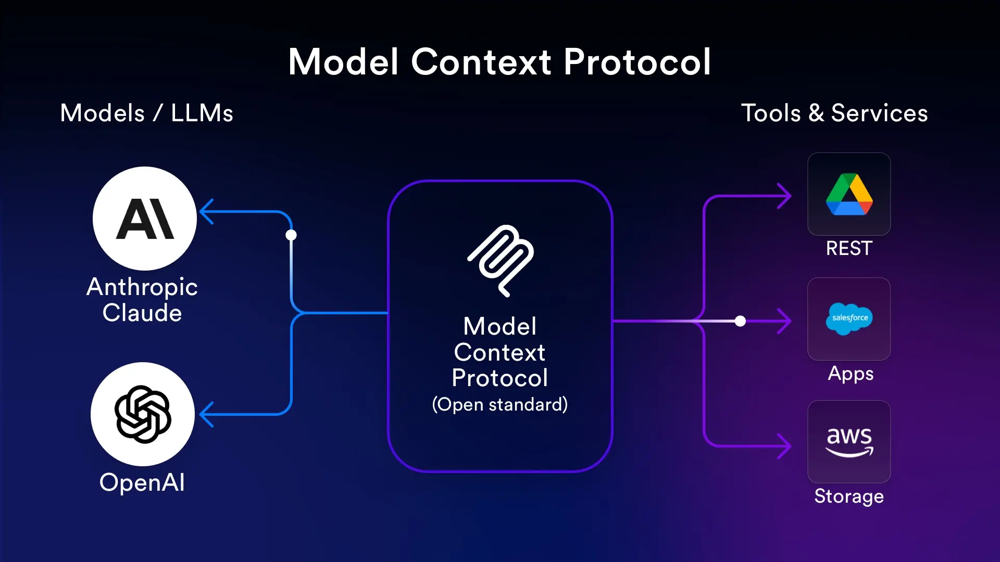

# MCP basics — structured starter guide

This note ties the **official Model Context Protocol (MCP)** model to what we built in this repository. Use it as a learning path before diving into `advanced.md` or the spec.

## Why MCP exists

MCP is a **standard way for AI applications to pull in context and actions** from external programs (databases, files, APIs, internal tools) without hard-coding every integration inside the app. The protocol focuses on **how context is exchanged**; it does **not** dictate how you call an LLM or manage prompts end-to-end. That boundary is spelled out in the official [architecture overview](https://modelcontextprotocol.io/docs/learn/architecture).

**Official intro & spec**

- [MCP documentation — getting started / intro](https://modelcontextprotocol.io/docs/getting-started/intro)
- [Architecture overview](https://modelcontextprotocol.io/docs/learn/architecture) (participants, layers, primitives, example JSON-RPC flow)
- [MCP specification (latest)](https://modelcontextprotocol.io/specification/latest)

**Anthropic learning**

- [Introduction to Model Context Protocol (Skilljar)](https://anthropic.skilljar.com/introduction-to-model-context-protocol)

## The three participants

From the [architecture docs](https://modelcontextprotocol.io/docs/learn/architecture):

| Role | What it is | In *this* repo |
|------|------------|----------------|
| **MCP host** | The AI application that owns one or more MCP clients and orchestrates them | `main.py` + `core/cli_chat.py` / `core/chat.py` — loads env, spawns clients, runs the chat loop with OpenRouter |
| **MCP client** | One logical connection to **one** server; discovers tools/resources/prompts and sends RPCs | `MCPClient` in `mcp_client.py` (stdio transport, `initialize`, `list_tools`, `call_tool`, resources, prompts) |
| **MCP server** | Process that **exposes** tools, resources, and prompts over the protocol | `mcp_server.py` (FastMCP server, `stdio`) |

Rule of thumb: **one server connection = one client instance**. The host may hold many clients (this project starts with the document server and can add more scripts via CLI args).

## Two layers (how messages move)

1. **Data layer** — [JSON-RPC 2.0](https://www.jsonrpc.org/) messages: lifecycle (`initialize`, capabilities), primitives (`tools/*`, `resources/*`, `prompts/*`), notifications, and optional client-facing features (sampling, elicitation, logging) per the [architecture overview](https://modelcontextprotocol.io/docs/learn/architecture).
2. **Transport layer** — how bytes are carried:
   - **Stdio** — parent process spawns the server; stdin/stdout carry JSON-RPC. **Local, one client typical.** This repo uses stdio for `mcp_server.py`.
   - **Streamable HTTP** — remote servers, many clients, standard HTTP auth patterns; OAuth recommended for tokens.

The same JSON-RPC shapes apply regardless of transport.

## Server primitives in order: Tools → Resources → Prompts

MCP servers expose three **core** primitives to clients ([architecture — primitives](https://modelcontextprotocol.io/docs/learn/architecture)). Read them in this order: **tools** are actions the model can take; **resources** are addressable facts the app can load; **prompts** are reusable message templates the app can fetch. Together they answer: *do something*, *show me this context*, *start from this scripted turn*.

**Discovery (all three)** — The client discovers what exists with `*/list` (`tools/list`, `resources/list`, `prompts/list`), then uses `tools/call`, `resources/read`, or `prompts/get`. Listings can change at runtime; servers may send notifications (e.g. `notifications/tools/list_changed`) when supported.

### Before the three: where they sit in the stack

The intro figure below is a good anchor: host application, MCP client(s), MCP server(s), and how context flows into the model. Keep it open while you read **Tools → Resources → Prompts**.

---

### 1. Tools

**What they are** — **Executable functions** the server registers with a name, human-readable description, and **JSON Schema** for arguments. The **host** exposes those definitions to the LLM; when the model returns a tool call, the host’s MCP **client** sends `tools/call` to the right server. The server runs the function and returns structured **content** (often text, sometimes other content types). Tools are the protocol’s answer to *“let the model act on the world”* (APIs, DB queries, file edits, etc.).

**Protocol** — `tools/list` (discover names + `inputSchema`), then `tools/call` with `name` and `arguments`. Responses are correlated by JSON-RPC `id`.

**Mental model** — **Model-initiated or host-routed actions** with a clear request/response. Side effects are allowed (e.g. writing data); design names and schemas so the model uses them safely.

**In this repo** — `mcp_server.py` defines `read_doc_contents` and `edit_document`. `core/tools.py` aggregates tools from every connected `MCPClient` for OpenRouter; `core/chat.py` runs the loop that sends tool results back to the model.

After tools, the next figure fits well: it stresses **client ↔ server** messaging (the same channel used for `tools/call` and for reads below).

---

### 2. Resources

**What they are** — **Addressable pieces of context**, usually identified by a **URI** (e.g. `file:///…`, `docs://documents/report.pdf`). The server exposes templates and metadata via `resources/list` / `resources/templates`; the client fetches bytes or text with `resources/read`. Resources are **read-oriented**: they supply data for the app or the model; they are not a generic “function call” surface like tools.

**Protocol** — `resources/list`, optional subscriptions/notifications in richer setups, and `resources/read` for a concrete URI.

**Mental model** — **“Pull this document into context.”** The host often decides **when** to read (user `@mention`, IDE open file, RAG chunk), not only the model. That’s why resources complement tools: tools *do*; resources *are*.

**In this repo** — `docs://documents` returns the list of document IDs; `docs://documents/{doc_id}` returns body text. `core/cli_chat.py` resolves `@deposition.md`-style mentions by reading those resources and injecting XML-wrapped snippets into the user message.

---

### 3. Prompts

**What they are** — **Reusable prompt templates** the server defines with a name, description, and arguments. The client calls `prompts/get` with the prompt name and parameters; the server returns a **list of messages** (roles + content) ready to append to the conversation. They standardize *workflows* (“always ask it this way”) without hard-coding that text in the host.

**Protocol** — `prompts/list`, then `prompts/get` with `name` and `arguments`.

**Mental model** — **Curated conversation starters or multi-step instructions** owned by the server (or product team), versioned with the server. Different from ad-hoc user chat: prompts are **named recipes** the UI or host can trigger.

**In this repo** — The `format` prompt in `mcp_server.py` takes `doc_id` and returns a user message that instructs the model to reformat the doc and use `edit_document`. `core/cli_chat.py` maps `/format doc_id` (slash commands) to `get_prompt` and merges the result into `messages`.

---

### At-a-glance comparison

| Order | Primitive | Question it answers | Typical driver | Key methods |
|------:|-----------|---------------------|----------------|-------------|
| 1 | **Tools** | What can the model *run*? | Often the **model** (tool calls) | `tools/list`, `tools/call` |
| 2 | **Resources** | What *data* exists at a URI? | Often the **host** / UI | `resources/list`, `resources/read` |
| 3 | **Prompts** | What *canned dialogue* should we insert? | **Host** / commands / UI | `prompts/list`, `prompts/get` |

## Lifecycle in one breath

1. Client connects over the transport.
2. **`initialize`** negotiates protocol version and **capabilities** (what each side supports).
3. Client sends **`notifications/initialized`** when ready.
4. Normal operation: list/call tools, read resources, get prompts; handle notifications if subscribed.

The official docs walk through sample `initialize`, `tools/list`, `tools/call`, and `notifications/tools/list_changed` payloads [here](https://modelcontextprotocol.io/docs/learn/architecture).

## How this codebase wires it together

High-level data path:

1. **`mcp_server.py`** — Defines tools, resources, and a prompt with **FastMCP**; `mcp.run(transport="stdio")` starts the server process.
2. **`mcp_client.py`** — Spawns that process with `StdioServerParameters`, opens a `ClientSession`, calls **`initialize`**, then exposes `list_tools`, `call_tool`, `read_resource`, `get_prompt`, etc.
3. **`main.py`** — Acts as the **host**: creates one `MCPClient` for `mcp_server.py` (and optionally more servers), builds `CliChat` / `CliApp`.
4. **`core/chat.py` + `core/tools.py`** — Aggregates tool definitions from all connected clients for the LLM and **executes** tool calls returned by the model (OpenRouter in `core/openrouter.py`).
5. **`core/cli_chat.py`** — Adds product behavior on top: `@doc` mentions pull **resources** into the user message; `/command` paths fetch **prompts** and append structured messages.

So: **MCP = protocol + primitives**; **this repo = a minimal host + one FastMCP server** demonstrating tools, resources, and prompts together.

## Suggested learning order

1. Read [Architecture overview](https://modelcontextprotocol.io/docs/learn/architecture) once with your diagrams open.
2. Read **Server primitives in order** (Tools → Resources → Prompts) in this file, then skim the spec or SDK for your language ([MCP SDKs](https://modelcontextprotocol.io/docs/sdk)).
3. Trace **`mcp_server.py`** → **`mcp_client.py`** → **`main.py`** → **`core/chat.py`** in that order.
4. Run the app per `README.md`, then use Tab completion and `@` / `/` flows to see resources and prompts in practice.
5. Optional: open a server with the [MCP Inspector](https://github.com/modelcontextprotocol/inspector) to inspect the same JSON-RPC surface without the chat UI.

## Glossary (quick)

- **Capability** — Feature negotiated at `initialize` (e.g. server supports tools and advertises `listChanged`).
- **Host** — Your application; owns clients and the LLM loop.
- **Primitive** — Tools, resources, prompts (and client-side counterparts like sampling in fuller stacks).
- **Transport** — Stdio vs HTTP; orthogonal to the JSON-RPC message format.

## References (bookmark)

- [modelcontextprotocol.io — Architecture](https://modelcontextprotocol.io/docs/learn/architecture)
- [modelcontextprotocol.io — Specification](https://modelcontextprotocol.io/specification/latest)
- [Anthropic — Intro to MCP (Skilljar)](https://anthropic.skilljar.com/introduction-to-model-context-protocol)
- [MCP reference servers](https://github.com/modelcontextprotocol/servers) (filesystem, etc.)
- This project: `README.md`, `mcp_server.py`, `mcp_client.py`, `main.py`
